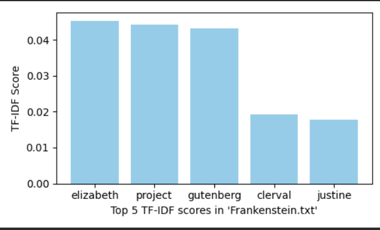
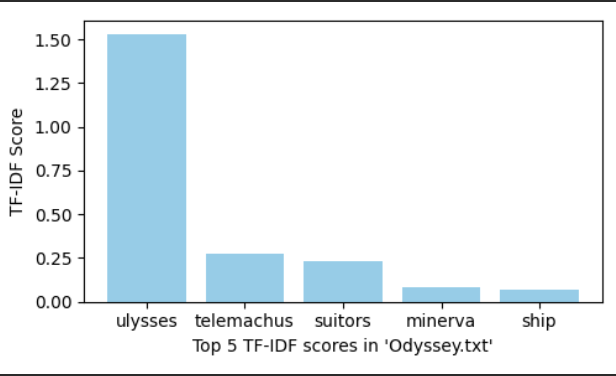
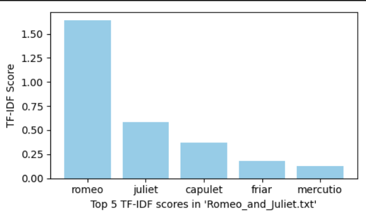

# TF-IDF Investigation on Classical Literary Works

## Project Description

This project is an investigation into how literary works compare in their word usage and frequency. Naturally, to accomplish this task TF-IDF was invoked on (specifically) 'Frankstein',
'The Odyssey', and 'Romeo and Juliet'. The code is set up where additional literary .txt files can be easily incorporated for further investigation and plots with the results will display. Results are also appended in this README.

## Results

### Frankenstein results

### The Odyssey results

### Romeo and Juliet results

## License

This project is licensed under the terms of the [MIT License](https://opensource.org/licenses/MIT).
